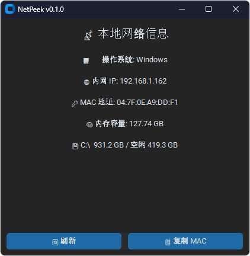
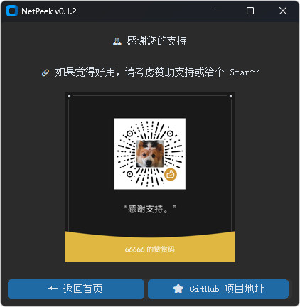

# NetPeek

```bash
uv venv
uv pip sync pyproject.toml

uv pip install psutil
uv pip freeze > src/requirements.txt
uv pip install -r src/requirements.txt

uv add -r requirements.txt
uv run main.py
```

## build \*.exe

```bash
uv pip install pyinstaller
pyinstaller --clean --add-data "pyproject.toml;." --add-data "src/assets;assets" --noconsole --onefile ./src/main.py
pyinstaller ./main.spec
```

## 本地网络信息查询器



## 赞赏/打赏


